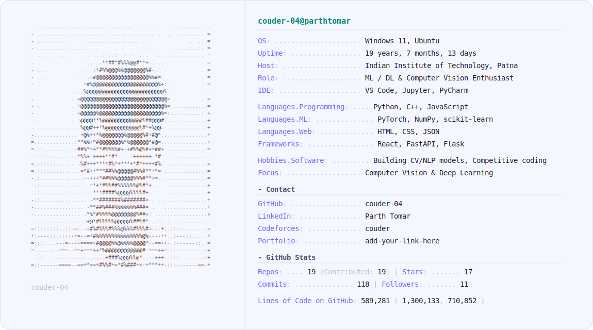

<a href="https://github.com/couder-04">
  <picture>
    <source media="(prefers-color-scheme: dark)" srcset="dark_mode.svg">
    
  </picture>
</a>

### 🛠️ Tech Stack

---

### 📌 Pinned Projects

| Project | Description |
|---|---|
| [VisionBench](https://github.com/couder-04/VisionBench) | Benchmarking Cat vs. Dog classification across 6 architectures — Logistic Regression, SVM, Custom CNN, ResNet-34, EfficientNet-B0, and ViT-Base |
| [NeuroSketch](https://github.com/couder-04/NeuroSketch) | End-to-end MNIST digit recognition system built from scratch with NumPy — training pipeline, dashboard, and interactive canvas app |
| [RepoRelic](https://github.com/couder-04/RepoRelic) | AI-powered developer intelligence platform analyzing repositories via a multi-stage autonomous pipeline |
| [TranscriptMind](https://github.com/couder-04/TranscriptMind) | NLP-powered transcript summarization turning long-form YouTube transcripts into concise summaries (TextRank, BART, PEGASUS, T5) |
| [CortexCPP](https://github.com/couder-04/CortexCPP) | Modular deep learning framework in C++ with a custom tensor runtime and CNN architecture construction |

---

### 🌐 Connect with me

---

The neofetch-style banner above (<code>light_mode.svg</code> / <code>dark_mode.svg</code>) has its GitHub Stats section (Uptime, Repos, Stars, Commits, Followers, Lines of Code) auto-updated daily by <a href="today.py"><code>today.py</code></a> via the GitHub Actions workflow in <a href=".github/workflows/main.yml"><code>.github/workflows/main.yml</code></a>. The OS / Host / Role / IDE / Languages / Hobbies fields are static — edit them directly in the two SVG files. See <a href="SETUP.md"><code>SETUP.md</code></a> for the one-time setup.
