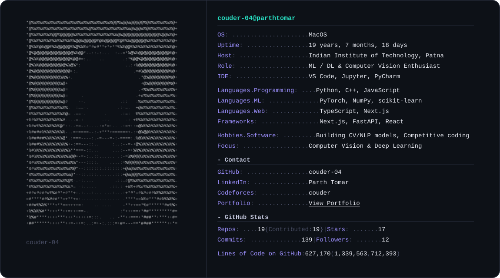

### 🛠️ Tech Stack

---

### 📌 Pinned Projects

| Project | Description |
|---|---|
| [CrossSight](https://github.com/couder-04/CrossSight) | City-wide ANPR intelligence — Indian plate OCR, trajectory reconstruction, traffic analytics, real-time alerts, and a GIS control-room dashboard |
| [CrossFlow](https://github.com/couder-04/CrossFlow) | City-scale traffic intelligence — ANPR sensing, flow analytics, and fuel-aware adaptive signal control in SUMO |
| [XtraFlow](https://github.com/couder-04/XtraFlow) | Adaptive fuel-weighted traffic signals in SUMO — pressure by idle fuel class, locked benchmarks, and a YOLO CCTV feasibility demo |
| [CortexCPP](https://github.com/couder-04/CortexCPP) | Modular deep learning framework in C++ with a custom tensor runtime, CNN construction, and end-to-end training |
| [circuit-vault](https://github.com/couder-04/circuit-vault) | Protect Logisim `.circ` files with per-circuit finals, Git sync, import, and build-from-prompt support |
| [NeuralAuth](https://github.com/couder-04/NeuralAuth) | Multi-task deep learning for adaptive transaction authentication — trust, risk, behavioral biometrics, and explainable policy-aware decisions |

---

### 🌐 Connect with me

---

The neofetch-style banner above (<code>light_mode.svg</code> / <code>dark_mode.svg</code>) has its GitHub Stats section (Uptime, Repos, Stars, Commits, Followers, Lines of Code) auto-updated daily by <a href="today.py"><code>today.py</code></a> via the GitHub Actions workflow in <a href=".github/workflows/main.yml"><code>.github/workflows/main.yml</code></a>. The OS / Host / Role / IDE / Languages / Hobbies fields are static — edit them directly in the two SVG files. See <a href="SETUP.md"><code>SETUP.md</code></a> for the one-time setup.
